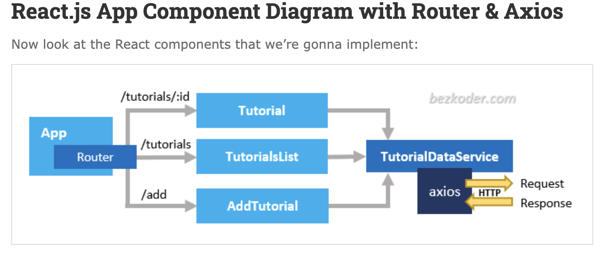

# Amy's Notes for this Tutorial

## Install
Lots of confusion as to if the react-hooks-crud project folder should be inside of the tutorial folder. Instructions were not clear but it seems weird to me to have a project folder with its own src and node_modules, etc under a folder with the it's own src/ node_modules, etc. Moved it in and out a couple of times and decided to keep it out. So the react-hooks-crud project folder is not in the tutorial folder. 

Also begining to udnerstand that when you do installs in command line there will always be loads of warnings of various levels but unless the install is dead stopped just press forward. Especially because this is just a tutorial.

### Project Structure

- App is the container that has Router & navbar.
– There are 3 items using React hooks: TutorialsList, Tutorial, AddTutorial.
– http-common.js initializes axios with HTTP base Url and headers.
– TutorialDataService has functions for sending HTTP requests to the Apis.

### Create Data Service
In this step a data service is created that uses an axios object to send HTTP requests.

_C_reate: create
_R_etreive: getAll, get
_U_pdate: update
_D_elete: remove, removeAll
and 
FINDER: findByTitle

Call axios (imported as http) get, post, put, delete method corresponding to HTTP Requests: GET, POST, PUT, DELETE to make CRUD Operations.

### Create React Components
3 components corresponding to the 3 Routes (Not sure what the Routes are??)

#### Add Object/AddTutorial
The AddTutorial object has data coming from a form with two fields the user can fill in, a title and a description. The form also has a submit button. 

\* Define and set intial state for tutorial and submitted
\* handleInputChange() takes the values from the form and sets the state
\* TutuorialDataService.create() grabs the setTutorial/setSubmitted data and sends the post request to the Web API
\* In the return the submitted state is checcked. If true then the button is reset to ADD and if false the button will display SUBMITT

#### List of Objects Component

Features of navbar for tutorials
\* Seachbar for tutorial titles
\* An array of tutorials displayed as a list on the left side 
\* A selected Tutorial displayed on the right

There are 4 variables that will have values for state
\* searchTitle
\* tutorials
\* currentTutorial
\* currentIndex

There are 3 TutorialDataService funtions
\* getAll()
\* removeAll()
\* findByTitle()

The Effect Hook, useEffect() fetches the data from the Web API and then tells React that the component needs to do something after rendering and/or performing the DOM updates. I know there are other tools to do this type of fetching which were mentioned in one of Marius's tutorials.

The last part is user editing of a tutorial. When the edit button is clicked the user is taken to the Tutorial page for editing. This is done with a React Rounter Link which accesses the page with the url /tutorials/:id. 

It is mentioned that you can also incorporate some pagination into this CRUD and there is a [link](https://www.bezkoder.com/react-pagination-hooks/) with an mini-tutorial. 

#### CORS Configuration
I added an .env file with a dedicated port of 3031 but do not understand why this was necessary. The turorial states "HTTP Server use CORS configuration that accepts resource sharing restricted to some sites or ports, so we also need to configure port for our App."

### Debugging
critical error
\*  TypeError: _serviceWorker__WEBPACK_IMPORTED_MODULE_5__.unregister is not a function

Checked what version of Webpack was installed. Typed "npm view webpack version" in command line. Using v. 5.73.0.

Found the fix for this and all the other subsequent less critical errors on the tuturial's github page.Another user of the tutorial added the necessary code to the serviceWorker.js file to get serviceWorker to function. 

